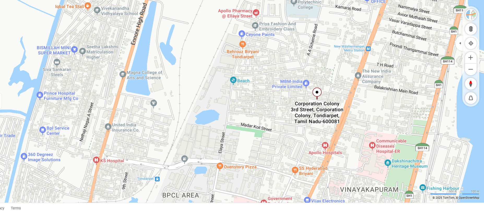

# Ex04 Places Around Me
# Date:
# AIM
To develop a website to display details about the places around my house.

# DESIGN STEPS
## STEP 1
Create a Django admin interface.

## STEP 2
Download your city map from Google.

## STEP 3
Using <map> tag name the map.

## STEP 4
Create clickable regions in the image using <area> tag.

## STEP 5
Write HTML programs for all the regions identified.

## STEP 6
Execute the programs and publish them.

# CODE
```
map.html

<!DOCTYPE html>
<html>
<head>

<title>My Area</title>
</head>
<body>
<h1 align="center">
  <font color="yellow"><b>Tondiarpet</b></font>
</h1>
<h3 align="center">
  <font color="red"><b>Saainath.B</b></font>
</h3>

<center> 
  

  <map name="MyArea">
    <area shape="poly" coords="776,228,955,228,1073,285,1061,278" title="Home" href="">
    <area shape="rect" coords="900,400,1000,470" title="Apollo" href="">
    <area shape="rect" coords="900,400,1000,500" title="SS Hyderabad" href="">
    <area shape="rect" coords="650,480,700,450" title="Ovenstory Pizza" href="">
    <area shape="rect" coords="1100,140,1200,160" title="Washermenpet Metro" href="">
  </map>
</center>
</body>
</html>

home.html


<!DOCTYPE html>
<html>
    <head>
        <title>CORPORATION COLONY 3RD STREET</title>
    </head>
    <body style="background:linear-gradient(30deg,pink,blue)">
    
    <center>
        <h1>MY HOME</h1>
        <h2 align=left>
        <pre>
Type: Residential Area
Address: 3rd Street, Corporation Colony, Tondiarpet, Chennai, Tamil Nadu 600081
Website: -
About:
A residential locality in Tondiarpet, well connected with nearby hospitals, 
restaurants and metro stations.
        </pre>
        </h2>
    </center>
</body>
</html>

Apollo.html


<!DOCTYPE html>
<html>
<head>
    <title>Apollo Hospital</title>
</head>
<body style="background:linear-gradient(30deg,pink,rgb(235, 24, 5))">
     
    <center>
        <h1>Apollo Hospital</h1>
        <h2 align="left">
        <pre>
Type: Multi-Speciality Hospital
Address: No. 13, 1st Floor, Thiruvottiyur High Road, Tondiarpet, Chennai - 600081
Website: https://www.apollohospitals.com
About:
Apollo Hospitals in Tondiarpet is part of the renowned Apollo group, 
offering advanced healthcare facilities, emergency care, 
multi-speciality treatments, and diagnostic services. 
It is one of the trusted hospitals in North Chennai.
        </pre>
        </h2>
    </center>
</body>
</html>

SShyderabad.html 
<!DOCTYPE html>
<html>
<head>
    <title>SS Hyderabad Biryani</title>
    
</head>
<body style="background:linear-gradient(30deg,pink,#eff708)">
     
    <center>
        <h1>SS Hyderabad Biryani</h1>
        <h2 align="left">
        <pre>
Type: Restaurant
Address: No. 128, Thiruvottiyur High Road, Tondiarpet, Chennai - 600081
About:
SS Hyderabad Biryani is a popular restaurant chain in Chennai, 
famous for its flavorful biryanis, curries, and South Indian delicacies. 
The Tondiarpet branch is a go-to spot for food lovers craving authentic taste.
        </pre>
        </h2>
    </center>
</body>
</html>


Ovenstorypizza.html


<!DOCTYPE html>
<html>
<head>
    <title>Ovenstory Pizza</title>
</head>
<body style="background:linear-gradient(30deg,pink,#ff6200)">
     
    <center>
        <h1>Ovenstory Pizza</h1>
        <h2 align="left">
        <pre>
Type: Pizza Outlet
Address: Ellaya Street, Tondiarpet, Chennai - 600081
Website:https://www.ovenstory.in
About:
Ovenstory Pizza is known for its delicious cheesy pizzas 
with a wide variety of bases and toppings. 
Located in Tondiarpet, it is a favorite spot for 
quick bites and home deliveries.
        </pre>
        </h2>
    </center>
</body>
</html>

Washermenpet.html


<!DOCTYPE html>
<html>
<head>
    <title>Washermenpet Metro Station</title>
</head>
<body style="background:linear-gradient(30deg,pink,blue)">
     
    <center>
        <h1>Washermenpet Metro Station</h1>
        <h2 align="left">
        <pre>
Type: Metro Station
Address: Washermenpet, Thiruvottiyur High Road, Chennai - 600021
Website: https://chennaimetrorail.org
About:
Washermenpet Metro is an important underground station on the 
Chennai Metro Blue Line. It connects North Chennai to major parts 
of the city, making travel faster and more convenient.
        </pre>
        </h2>
    </center>
</body>
</html>

views.py

from django.shortcuts import render
from django.http import HttpResponse
from django.shortcuts import render
def map(request):
    return render(request, 'map.html')
def home(request):
    return render(request, 'home.html')
def Apollo(request):
    return render(request, 'Apollo.html')
def SShyderabad(request):
    return render(request, 'SShyderabad.html')
def Ovenstorypizza(request):
    return render(request, 'Ovenstorypizza.html')
def WashermenpetMetro(request):
    return render(request, 'WashermenpetMetro.html')

urls.py

"""
URL configuration for SAAI project.

The `urlpatterns` list routes URLs to views. For more information please see:
    https://docs.djangoproject.com/en/5.2/topics/http/urls/
Examples:
Function views
    1. Add an import:  from my_app import views
    2. Add a URL to urlpatterns:  path('', views.home, name='home')
Class-based views
    1. Add an import:  from other_app.views import Home
    2. Add a URL to urlpatterns:  path('', Home.as_view(), name='home')
Including another URLconf
    1. Import the include() function: from django.urls import include, path
    2. Add a URL to urlpatterns:  path('blog/', include('blog.urls'))
"""
from django.contrib import admin
from django.urls import path
from mapapp import views

urlpatterns = [
    path('admin/', admin.site.urls),
    path('', views.map),
    path('home/',views.home,name='home'),
    path('apollo/',views.Apollo,name='apollo'),
    path('sshyderabad/',views.SShyderabad,name='sshyderabad'),
    path('ovenstory/',views.Ovenstorypizza,name='ovenstory'),
    path('washermenpet/',views.WashermenpetMetro,name='washermenpet'),


]


```
# OUTPUT

.png>)
.png>)
.png>)
.png>)
.png>)
# RESULT
The program for implementing image maps using HTML is executed successfully.
